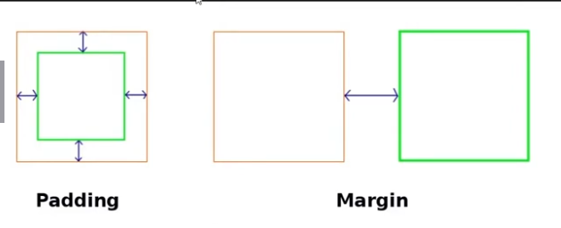

## Propriedades de Dimensionamento e Espaçamento
+40XP
### Largura e Altura
As propriedades `width` e `height` definem, respectivamente, a largura e a altura de um elemento. Elas podem usar unidades fixas, como `px`, ou relativas, como `%`, `vw` e `vh`.

```css
.caixa {
	width: 50%;
	height: 200px;
}
```

### Altura e Largura Máxima e Mínima
`min-width` e `min-height` definem o tamanho mínimo de um elemento. `max-width` e `max-height` limitam seu tamanho máximo, sendo úteis para criar layouts responsivos.

```css
img {
	width: 100%;
	max-width: 600px;
	height: auto;
}
```

---


---


### Margin
`margin` cria espaço externo entre o elemento e os elementos ao redor. É possível definir valores individuais para cada lado ou usar a forma abreviada.

```css
.card {
	margin: 16px auto;
}
```

### Padding 
`padding` cria espaço interno entre o conteúdo e a borda do elemento. Também pode ser definido individualmente ou com uma declaração abreviada.

```css
.card {
	padding: 24px;
}
```

### Box Sizing
`box-sizing` define como `width` e `height` são calculadas. Com `border-box`, o tamanho informado inclui o conteúdo, o `padding` e a borda, facilitando o controle do layout.

```css
* {
	box-sizing: border-box;
}
```
