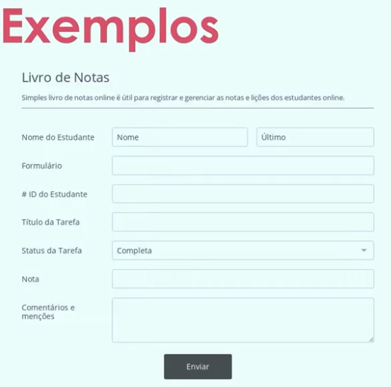

## Trabalhando com Formulários no HTML
- Formulários são elementos essenciais para a interação do usuário com uma página web. Eles permitem que os usuários enviem dados, como informações de login, pesquisas, comentários e muito mais.

> Com essa informação chega do cliente a

---


---

### Tipos de Tags:
> Tag <form> - Define o início e o fim do formulário.

- Exemplo explicativo da estrutura:
```html
<form action="/submit" method="post">
  <label for="name">Nome:</label>
  <input type="text" id="name" name="name" required>
  <input type="submit" value="Enviar">
</form>
```

- action: Define a URL para onde os dados do formulário serão enviados.
- method: Define o método HTTP a ser usado (GET ou POST).
- target: Define onde abrir a resposta do formulário (ex: _blank, _self).
- autocomplete: Indica se o navegador deve preencher automaticamente os campos com base em entradas anteriores.
- onsubmit: Define uma função JavaScript a ser executada quando o formulário for enviado.

### Campo input e seus tipos
- O elemento `<input>` é usado para criar campos de entrada de dados. Ele possui diversos tipos, cada um adequado para diferentes tipos de informações.

> Tipos de input mais comuns:
- text: Campo de texto simples.
- password: Campo para senha, oculta os caracteres digitados.
- email: Campo para endereço de e-mail, valida o formato do e-mail.
- number: Campo para números, permite apenas entradas numéricas.
- checkbox: Caixa de seleção, permite múltiplas escolhas.
- radio: Botão de opção, permite apenas uma escolha entre várias opções.
- submit: Botão para enviar o formulário.

> Checkbox e Radio (EXPLICAÇÃO)
- Checkbox permite selecionar múltiplas opções, enquanto Radio permite selecionar apenas uma opção de um grupo.
- Exemplo de Checkbox:
```html
<label><input type="checkbox" name="interests" value="coding"> Programação</label>
<label><input type="checkbox" name="interests" value="music"> Música</label>
```

- Exemplo de Radio:
```html
<label><input type="radio" name="gender" value="male"> Masculino</label>
<label><input type="radio" name="gender" value="female"> Feminino</label>
```     

### Select e seus tipos
- O elemento `<select>` é usado para criar uma lista suspensa de opções. Ele permite que o usuário selecione uma opção de um conjunto predefinido.
- Exemplo de Select:
```html
<label for="country">País:</label>
<select id="country" name="country">
  <option value="br">Brasil</option>
  <option value="us">Estados Unidos</option>
  <option value="uk">Reino Unido</option>      
</select>
```     

### Textarea
- O elemento `<textarea>` é usado para criar uma área de texto multilinha, permitindo que os usuários insiram textos mais longos, como comentários ou descrições.
- Exemplo de Textarea:
```html
<label for="message">Mensagem:</label>
<textarea id="message" name="message" rows="4" cols="50"></textarea>
```