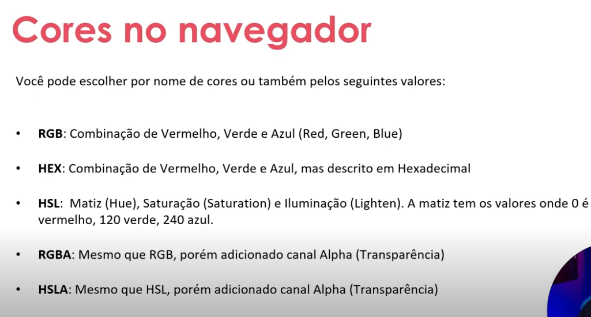

## Estruturando seu HTML + Formatações

### Formatando textos: `<strong>`, `<i>`, `<b>` e `<u>`

- **`<strong>`**: indica que o texto tem forte importância semântica, normalmente exibido em negrito.
	- **Sintaxe:** `<strong>Texto importante</strong>`
	- **Exemplo:** `Atenção: <strong>salve o arquivo</strong> antes de sair.`
- **`<i>`**: representa uma parte do texto em uma voz ou estilo alternativo, normalmente exibido em itálico.
	- **Sintaxe:** `<i>Texto em itálico</i>`
	- **Exemplo:** `O termo <i>frontend</i> é usado neste curso.`
- **`<b>`**: aplica destaque visual em negrito, sem indicar importância semântica.
	- **Sintaxe:** `<b>Texto em negrito</b>`
	- **Exemplo:** `Use a palavra-chave <b>HTML</b> no documento.`
- **`<u>`**: sublinha o texto; deve ser usado quando o sublinhado fizer parte do significado ou da apresentação.
	- **Sintaxe:** `<u>Texto sublinhado</u>`
	- **Exemplo:** `Este é um <u>termo destacado</u>.`

### Formatando textos: `<font>`

A tag `<font>` altera fonte, tamanho e cor diretamente no HTML, mas está obsoleta no HTML5. Prefira CSS para controlar a aparência.

- **Sintaxe legada:** `<font face="Arial" size="4" color="blue">Texto</font>`
- **Exemplo recomendado:** `<p style="font-family: Arial; color: blue;">Texto formatado</p>`

### Tag `<div>` e `<span>`

`<div>` é um elemento de bloco usado para agrupar seções e outros elementos. `<span>` é um elemento em linha usado para destacar pequenos trechos de texto.

- **Sintaxe:** `<div>Conteúdo em bloco</div>` e `<span>Conteúdo em linha</span>`
- **Exemplo:** `<div class="card">Preço: <span class="preco">R$ 20,00</span></div>`

### Tag `<fieldset>`

`<fieldset>` agrupa controles relacionados de um formulário. A tag `<legend>` fornece o título do grupo.

- **Sintaxe:** `<fieldset><legend>Título</legend>Controles</fieldset>`
- **Exemplo:**

```html
<fieldset>
	<legend>Dados pessoais</legend>
	<label for="nome">Nome:</label>
	<input id="nome" name="nome" type="text">
</fieldset>
```

### Tag `<embed>`

`<embed>` incorpora um recurso externo, como um PDF ou outro conteúdo compatível com o navegador. Use atributos `src` e `type` para informar o arquivo e seu formato.

- **Sintaxe:** `<embed src="arquivo.pdf" type="application/pdf">`
- **Exemplo:** `<embed src="documento.pdf" type="application/pdf" width="600" height="400">`

### Tag `<iframe>`

`<iframe>` incorpora outra página ou documento dentro da página atual. Use `title` para acessibilidade e defina dimensões conforme necessário.

- **Sintaxe:** `<iframe src="URL" title="Descrição"></iframe>`
- **Exemplo:** `<iframe src="https://www.example.com" title="Página de exemplo" width="600" height="400"></iframe>`

### Resenha: sobre cores

As cores ajudam a organizar a informação, criar hierarquia visual e transmitir sensações. Em HTML, elas podem ser definidas com nomes, valores hexadecimais, `rgb()` ou `hsl()`, geralmente por meio de CSS. É importante manter contraste suficiente entre texto e fundo, não depender apenas da cor para comunicar uma informação e escolher uma paleta consistente. Por exemplo:

```html
<p style="color: #1e3a8a; background-color: #dbeafe;">
	Texto com bom contraste.
</p>
```
---


---