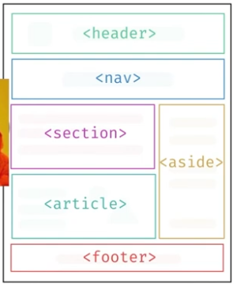

## Entendendo HTML Semântico

HTML semântico é o uso de elementos que descrevem o significado e a função do
conteúdo, em vez de usar apenas elementos genéricos como `<div>` e `<span>`.
Isso melhora a organização do código, a acessibilidade, o SEO e a manutenção
da página.

## Melhorias nas versões do HTML

O HTML evoluiu de documentos simples para uma linguagem voltada à estrutura do
conteúdo e à Web moderna. No HTML5, foram introduzidos elementos semânticos
como `<main>`, `<header>`, `<footer>`, `<nav>`, `<section>` e `<article>`, além
de recursos multimídia como `<audio>`, `<video>`, `<figure>` e `<picture>`.

---


---

**Exemplo:**

```html
<!DOCTYPE html>
<html lang="pt-BR">
	<head>
		<meta charset="UTF-8">
		<meta name="viewport" content="width=device-width, initial-scale=1.0">
		<title>Minha página</title>
	</head>

	<body>
		<header>Topo da página</header>
		<main>Conteúdo principal</main>
        <footer>Rodapé da página</footer>
	</body>
</html>
```

## Acessibilidade

A acessibilidade permite que pessoas com diferentes necessidades usem o site.
Use HTML semântico, textos alternativos em imagens, títulos em ordem lógica,
rótulos em formulários, contraste adequado e atributos `lang` corretos. Um
leitor de tela consegue interpretar melhor `<nav>` e `<main>` do que várias
`<div>` sem significado.

**Exemplo:**

```html

<label for="email">E-mail</label>
<input id="email" type="email" name="email">
```

> WAI-ARIA (*Web Accessibility Initiative - Accessible Rich Internet Applications*) é um conjunto de atributos que melhora a acessibilidade de elementos interativos, como menus e abas, para leitores de tela.

## Web Scraping

Web scraping é a coleta automatizada de informações de páginas da Web. O uso
de HTML semântico facilita a identificação de títulos, artigos e preços por
ferramentas automatizadas. A coleta deve respeitar a legislação, os termos de
uso do site e o arquivo `robots.txt`.

**Exemplo de estrutura fácil de interpretar:**

```html
<article>
	<h2 class="titulo">Curso de HTML</h2>
	<p class="preco">R$ 49,90</p>
</article>
```

## `<main>`, `<header>`, `<footer>`

- `<main>`: contém o conteúdo principal e único da página.
- `<header>`: representa o cabeçalho de uma página ou seção.
- `<footer>`: representa o rodapé de uma página ou seção.

**Sintaxe e exemplo:**

```html
<header>
	<h1>Portal de notícias</h1>
</header>
<main>
	<h2>Notícia principal</h2>
	<p>Conteúdo da notícia.</p>
</main>
<footer>
	<p>&copy; 2025 Portal de notícias</p>
</footer>
```

## `<nav>`, `<section>`, `<aside>`

- `<nav>`: reúne links de navegação importantes.
- `<section>`: agrupa conteúdo relacionado, normalmente com um título.
- `<aside>`: contém conteúdo complementar ao conteúdo principal.

**Sintaxe e exemplo:**

```html
<nav aria-label="Navegação principal">
	<a href="/inicio">Início</a>
	<a href="/contato">Contato</a>
</nav>
<section>
	<h2>Artigos recentes</h2>
	<p>Confira nossas publicações.</p>
</section>
<aside>
	<h2>Links relacionados</h2>
	<a href="/arquivo">Arquivo</a>
</aside>
```

## `<article>`, `<blockquote>`, `<q>`

- `<article>`: conteúdo independente, como uma notícia, postagem ou comentário.
- `<blockquote>`: citação longa, geralmente exibida em um bloco separado.
- `<q>`: citação curta inserida no fluxo do texto.

**Sintaxe e exemplo:**

```html
<article>
	<h2>Aprendendo HTML</h2>
	<p>HTML organiza o conteúdo de uma página.</p>
</article>

<blockquote cite="https://www.w3.org/">
	A Web foi criada para ser acessível a todos.
</blockquote>

<p>Como diz o ditado: <q>menos é mais</q>.</p>
```

## `<figure>`, `<figcaption>`, `<picture>`

- `<figure>`: conteúdo ilustrativo, como imagem, gráfico ou código.
- `<figcaption>`: legenda associada ao conteúdo de `<figure>`.
- `<picture>`: oferece diferentes imagens conforme o tamanho ou a resolução da tela.

**Sintaxe e exemplo:**

```html
<figure>
	<picture>
		<source media="(min-width: 800px)" srcset="paisagem-grande.jpg">
		
	</picture>
	<figcaption>Paisagem registrada durante a viagem.</figcaption>
</figure>
```

## Resenha: o que é SEO?

SEO (*Search Engine Optimization*) é o conjunto de práticas para melhorar a
visibilidade de uma página nos resultados orgânicos dos mecanismos de busca.
HTML semântico contribui para o SEO porque ajuda os buscadores a entenderem a
hierarquia e o assunto do conteúdo.

Boas práticas incluem usar um `<title>` descritivo, uma única tag `<h1>` para
o assunto principal, subtítulos em ordem, links com textos claros, imagens com
`alt`, URLs compreensíveis e conteúdo útil. SEO não significa inserir palavras
-chave repetidamente: qualidade, acessibilidade, desempenho e boa experiência
do usuário também são importantes.

**Exemplo:**

```html
<head>
	<title>Guia de HTML semântico | Estudos Front-end</title>
	<meta name="description" content="Aprenda os principais elementos do HTML semântico.">
</head>
<body>
	<article>
		<h1>Guia de HTML semântico</h1>
		<p>Aprenda a estruturar páginas acessíveis e bem organizadas.</p>
	</article>
</body>
```
