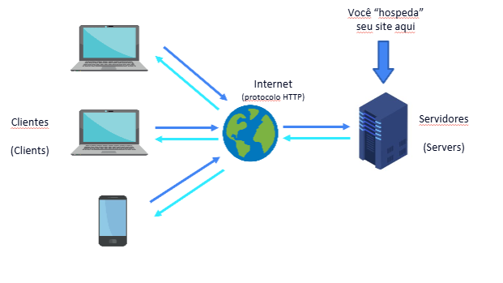
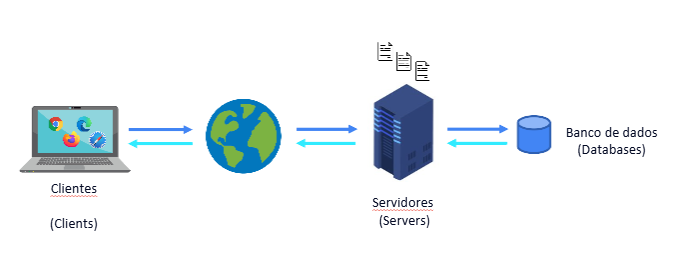

## Introdução ao Web
### História da Web​
- Primeiros computadores:
- 1a geração Harvard Mark I (1944)
- 1a geração Colossus (1946)
- 1a geração ENIAC (1946)
- 2a geração Transistor (1959 - 1965)
- 3a geração Circuitos Integrados (1965 - 1970)
- 4a geração Microprocessadores (1971 - 1980)
- 5a geração Inteligência Artificial

- Internet:
- Telégrafo (1958)
- guerra fria
- Joseph Carl Robnett Licklider (Teorizou sobre uma rede onde todos poderiam se comunicar através dela.​)

- Sistema de comunicação em pacotes, enviados um a um e que permitia múltiplos destinos.​ 
- Estudos sobre nós. Pontos de intersecção de informações funcionando como “checkpoints”. Podemos dizer que é o “avô dos roteadores”.​

- Primeira conexão estabelecida foi feita em 29/10/1969.​
- Em 1989, Tim Berners-Lee viu a oportunidade de unir hipertexto com TCP/IP e criar a World Wide Web (WWW)​.

### Conceito de Client​
- O cliente é o computador que solicita informações de outro computador, chamado de servidor.​

- O cliente envia uma solicitação ao servidor, que processa a solicitação e envia de volta a resposta ao cliente.​

- O cliente pode ser um navegador da web, um aplicativo de e-mail ou qualquer outro software que se conecta a um servidor para obter informações.​

- O cliente é responsável por apresentar as informações recebidas do servidor de forma compreensível para o usuário final.

---

---

#### Navegadores
- São programas criadas por empresas, utilizados para abrir/executar arquivos.​ 
- Seguem padrões W3C, porém, sempre tem uma diferença ou outra de interpretação.​
- Também chamados de “browsers”​.
- Iniciou com o MOSAIC, passou para o Netscape, e hoje temos uma variedade de navegadores disponíveis.
-​ Gratuitos​.

#### Aplicações Web​
- Aplicações Web são soluções criadas que possuem a internet como meio de comunicação entre Client x Server não sendo necessário a sua instalação.​
---

---

#### Dispositivos móveis​
- São dispositivos portáteis que possuem recursos de computação e conectividade à internet, permitindo aos usuários acessar informações, aplicativos e serviços online de qualquer lugar.​

### Conceito de Server​
- O servidor é o computador que fornece informações ou serviços para outros computadores, chamados de clientes.

- **Tipos**: Arquivos, Segurança, Streaming, Web, Banco de dados, E-mail, Proxy, DNS, FTP, Print, Jogos, Aplicações.

- O servidor recebe solicitações dos clientes, processa essas solicitações e envia de volta as respostas apropriadas.

- Software de servidor é projetado para gerenciar recursos, armazenar dados e fornecer serviços de forma eficiente e confiável. (Parte do software de servidor pode incluir sistemas operacionais, servidores web, servidores de banco de dados e outros componentes necessários para fornecer serviços aos clientes.)

- Hardware de servidor é geralmente mais robusto e confiável do que o hardware de cliente, pois precisa lidar com múltiplas solicitações simultâneas e garantir alta disponibilidade. (Parte Física do servidor pode incluir processadores mais rápidos, maior capacidade de memória, armazenamento redundante e sistemas de resfriamento avançados para garantir desempenho e confiabilidade.)

> Sistema operacional: windows server, linux server, unix server, mac os server.

> Servidores web: apache, nginx, iis, tomcat.

#### Requisição HTTP​
- O protocolo HTTP (Hypertext Transfer Protocol) é o protocolo de comunicação utilizado na web para
- transferir informações entre clientes e servidores. Ele define como as mensagens são formatadas e transmitidas, e como os servidores e navegadores devem responder a diferentes tipos de solicitações.

#### Tipos de servidores
- Servidor de Arquivos: Armazena e gerencia arquivos, permitindo que os clientes
    acessem, compartilhem e façam backup de dados. Exemplo: FTP (File Transfer Protocol).​

- Servidor de Segurança: Fornece autenticação, autorização e criptografia para proteger dados e recursos. Exemplo: Servidores VPN (Virtual Private Network).​

- Servidor de Streaming: Transmite áudio e vídeo em tempo real para os clientes. Exemplo: Servidores de mídia como Wowza ou Red5.​

- Servidor Web: Hospeda sites e aplicativos web, respondendo a solicitações HTTP dos clientes. Exemplo: Apache, Nginx, Microsoft IIS.​

- Servidor Proxy: Atua como intermediário entre clientes e servidores, melhorando desempenho, segurança e controle de acesso. Exemplo: Squid Proxy.​

- Firewall: Monitora e controla o tráfego de rede, protegendo a rede contra acessos não autorizados. Exemplo: pfSense, Cisco ASA.​

- Aplication Server: Fornece um ambiente para executar aplicativos web e serviços, gerenciando a lógica de negócios e a comunicação com bancos de dados. Exemplo: JBoss, WebLogic, Tomcat.​

- Database Server: Armazena, gerencia e fornece acesso a bancos de dados, permitindo que os clientes realizem consultas e operações de dados. Exemplo: MySQL, PostgreSQL, Oracle Database.​
#### Hospedagem de sites
- A hospedagem de sites é o serviço que permite que indivíduos e organizações publiquem seus sites na internet, tornando-os acessíveis a usuários em todo o mundo. Os provedores de hospedagem oferecem infraestrutura, recursos e suporte técnico para garantir que os sites funcionem de forma eficiente e segura.

- Pela internet.

### Linguagens de programação
- Definição: Linguagem de programação é um conjunto de regras e instruções que permitem aos desenvolvedores criar programas de computador, aplicativos e sistemas. Essas linguagens fornecem uma forma estruturada de comunicar comandos ao computador, permitindo que ele execute tarefas específicas.

> Linguagens que rodam no servidor: PHP, Python, Java, C#, Ruby, Node.js.

> Linguagens que rodam no cliente: HTML, CSS, JavaScript.

### Html
- HTML (Hypertext Markup Language) é a linguagem de marcação padrão utilizada para criar páginas web. Ele define a estrutura e o conteúdo de um documento web, permitindo que os navegadores interpretem e exibam corretamente o conteúdo para os usuários. O HTML utiliza uma série de elementos e tags para organizar texto, imagens, links, formulários e outros elementos em uma página web.

