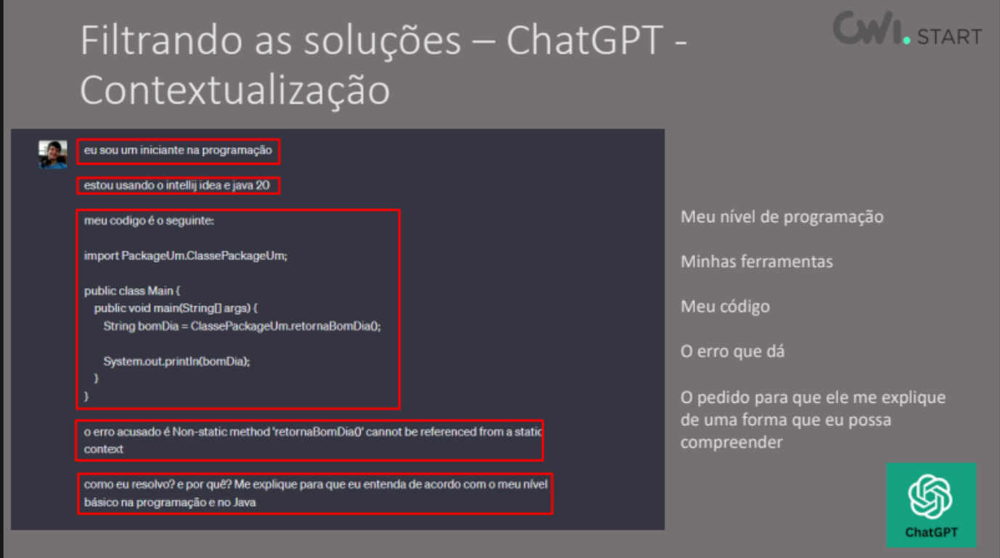

## Introdução à Programação
- Histórico:
> A história da programação começou com uma mulher.

- É através dos algoritmos que são dadas instruções às máquinas para desempenhar certas tarefas, o que faz de Ada Lovelace a primeira programadora da história!

> O primeiro computador da história: 

- O algoritmo de Ada foi desenvolvido para esta engenhoca aqui, criada por Charles Babbage. Sua função era comandar máquinas de tecer. Ele fazia isso através de um complexo (para a época) sistema de cartões perfurados que continham vários padrões de códigos e cada código representava um comando diferente para a máquina.

> ENIAC, o computador de guerra


> Grace Hopper e a revolução na programação


> Deep Blue, o computador que derrotou um campeão de xadrez

> IBM PC, o primeiro computador pessoal

> Bill Gates e o início da Microsoft

- O que é programação?
> Programação é o processo de criar um conjunto de instruções que dizem a um computador como realizar uma tarefa. A programação pode ser feita usando várias linguagens de programação, como JavaScript, Python, Java, C++, entre outras. Através da programação, podemos criar software, aplicativos, jogos e muito mais.

- Lógica de programação
> A lógica de programação é a base para escrever código eficiente e funcional. Ela envolve a capacidade de pensar de forma estruturada e resolver problemas de maneira lógica. A lógica de programação é essencial para criar algoritmos que possam ser implementados em código. Ela inclui conceitos como controle de fluxo, estruturas de dados, funções e muito mais. Desenvolver uma boa lógica de programação é fundamental para se tornar um programador habilidoso e capaz de criar soluções eficazes para os desafios de programação.

- Exemplos de lógica de programação:
> Exemplo 1: Verificar se um número é par ou ímpar

```javascript
var numero = 10;
if (numero % 2 === 0) {
  console.log("O número é par.");
} else {
  console.log("O número é ímpar.");
}
```

- *Algoritmo*: é uma sequência de passos ou instruções que descrevem como realizar uma tarefa específica. Ele é a base para a programação, pois é a partir do algoritmo que o código é escrito. Um algoritmo pode ser representado de várias formas, como em pseudocódigo, fluxogramas ou diretamente em código de programação.

- *Abstração*: é o processo de simplificar um problema complexo, focando apenas nos aspectos essenciais e ignorando os detalhes desnecessários. 

---


---